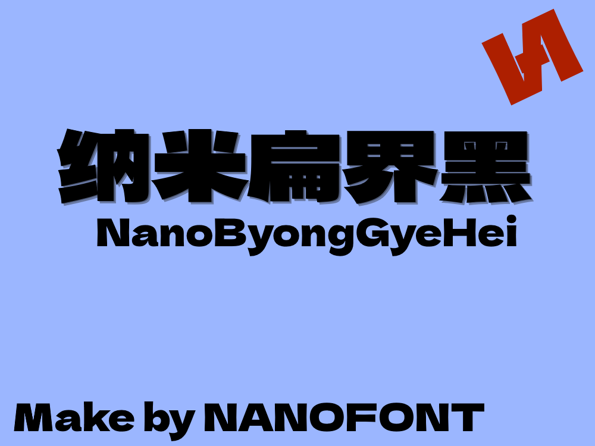

<h1>纳米扁界黑 (NanoByongGyeHei)</h1>

## 简介
一个基于标小智无界黑和馒头黑结合并补充的字体 

## 收录字形一览
> [!IMPORTANT]
>
> **未打勾**的为不支持或部分支持的区域
>
> **打勾**的为已经全部支持的区域

- 中文编码
  - [x] GB/T 2312
  - [x] 现代汉语常用字表
  - [x] 现代汉语通用字表
  - [x] 义务教育语文课程常用字表
  - [x] 通用规范汉字表
  - [ ] GBK
  - [ ] GB 18030
  - [x] 常用国字标准字体表
  - [ ] 次常用国字标准字体表
  - [ ] Big5 常用
  - [ ] Big5
  - [x] 繁体常用字形表
  - [ ] HKSCS
  - [ ] 香港常用外字表1-6级
  - [ ] GB/T 12345
- 方言用字
  - [ ] 温州话

## 字体授权
基于 SIL-OFL 发行

## 制作者

制作者：[**H.S.S. - 寒沙**](https://github.com/Hansha2011/)

## 联系

QQ: **3582930858**

E-Mail: **3582930858@qq.com**

> [!TIP]
>
> 其他链接请到主页介绍文本上查找
